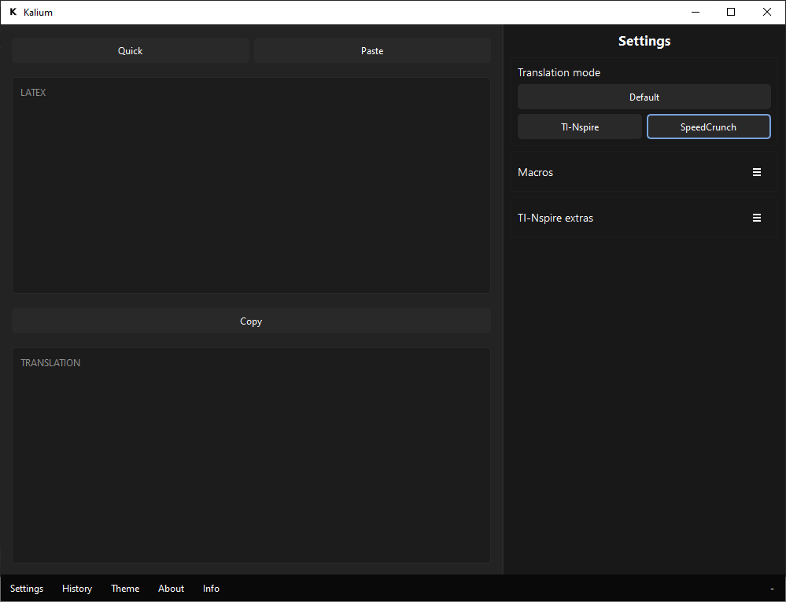
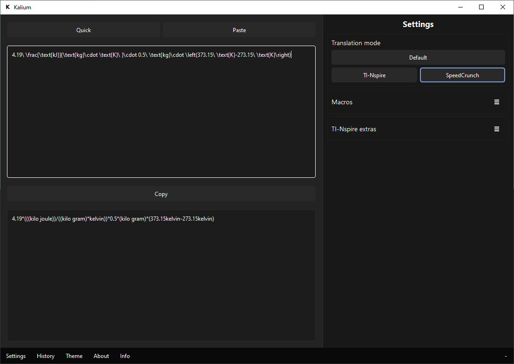
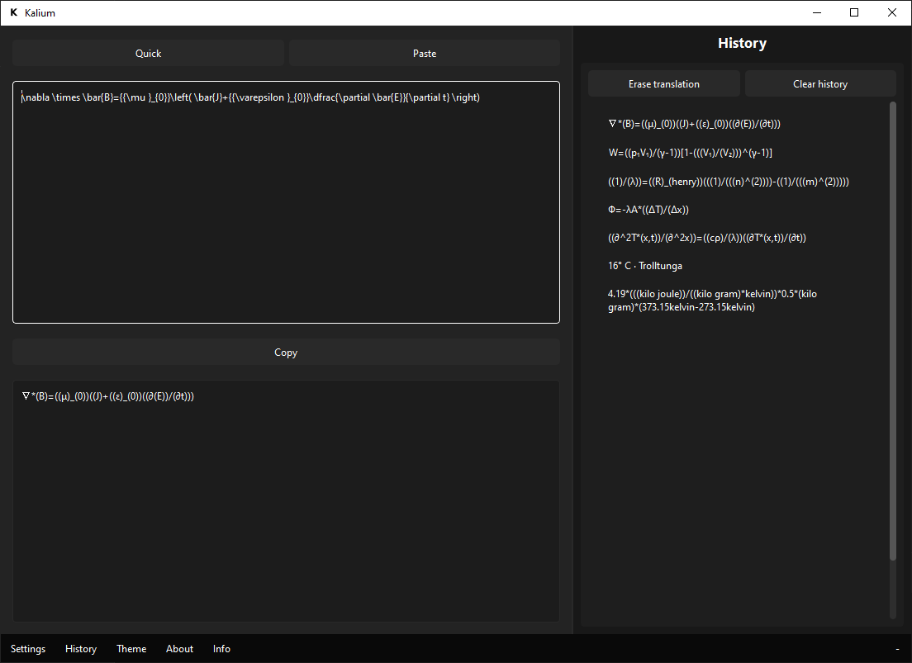
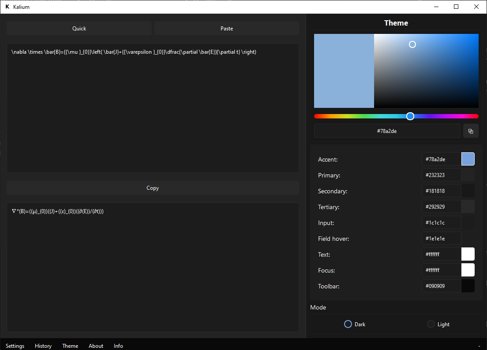
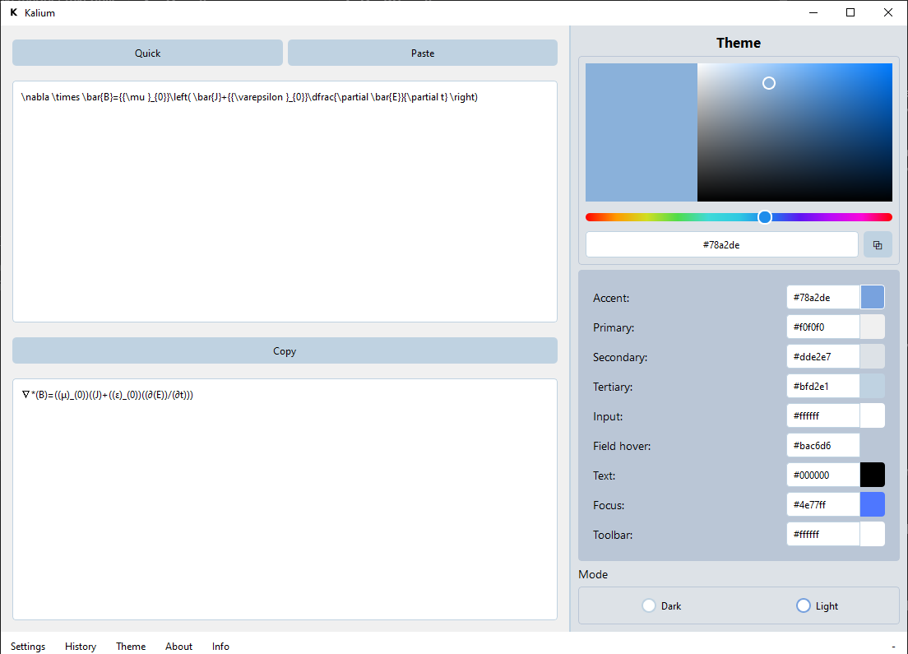
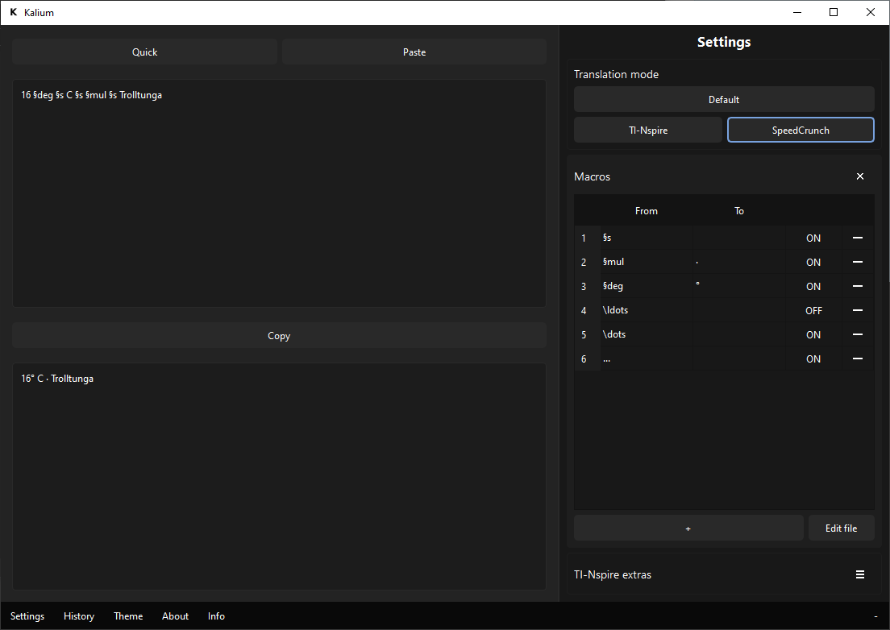
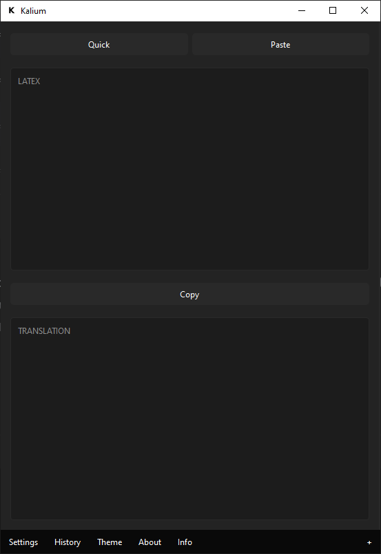
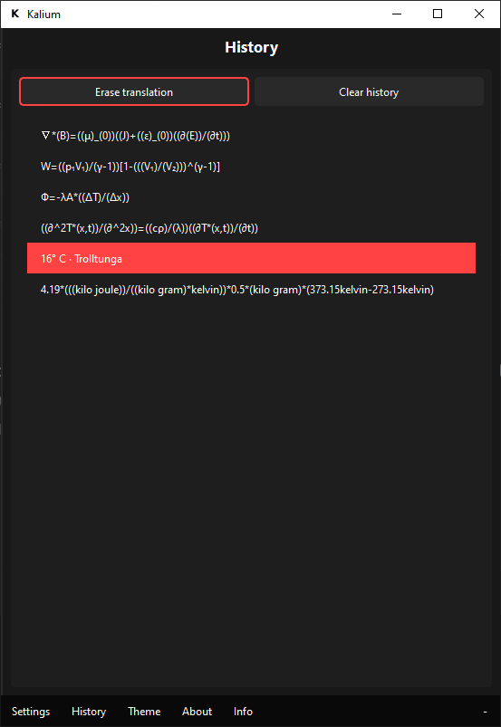
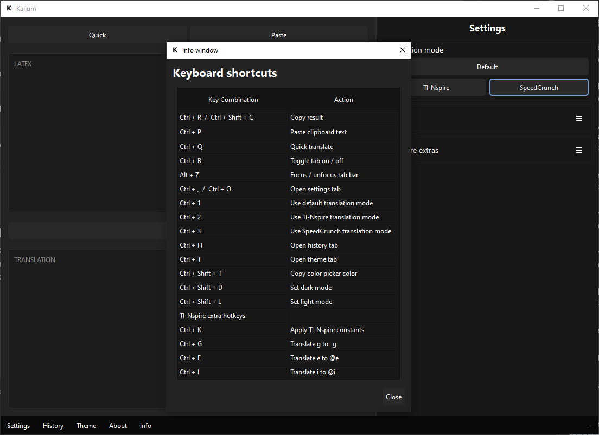

# Kalium

A tool made in high school as a total beginner to translate LaTeX expressions to calculators.

## Goals
- Improve workflow and reduce distractions

> [!WARNING]  
> The code is a dumpster fire and worked by mashing things together ASAP. The executable is provided while the translation code is not. Unless I clean it up.

## Supported calculators:
- TI-nspire CX-CAS calculator, with units
- SpeedCrunch, with units.
- Or just strip LaTeX to raw symbolic expressions.

## Screenshots
Start view.

Example with units on for SpeedCrunch.

History

Themes (custom themes are implemented but locked as of now)

Macros

The app can be minified from the +/- button.

List of shortcuts.

## License
[MIT](https://choosealicense.com/licenses/mit/)